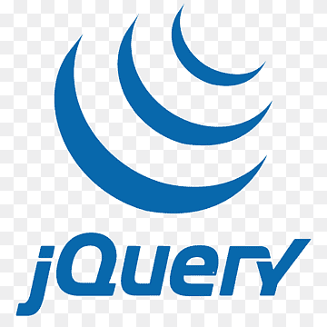

# **_Olá,seja bem-vinde!_**

   ##
  Olá pessoal, meu nome é Ana Kelly. Sou técnica em informática, graduada em Análises e desenvolvimento de sistemas pela Universidade Estácio de Sá, e pós graduanda em Engenharia de sotfware pela mesma Universidade. Sou Analista de qualidade de software atuando a 4 anos no mercado objetificando a qualidade e experiência do usuário final. Utilizo este repositório para anexar meus trabalhos e curiosidades técnicas. 
 
##
**Idiomas:**

  Eu sou nativa e fluente em português, e possuo inglês intermediário para conversação do dia a dia e técnica. Além disso, sei me comunicar na linguagem de sinais, libras. 

   ##

**Tecnológias:**

  Apaixonada por tecnologia, programação, inovação e experiência do usuário. Estes são alguns skills que já trabalhei e possuo vastas experiências:

  **Back-end:**
  

 

##

**Frameworks front-end:**

 

 

##

**Controle de versionamento:**

 

##

 **Banco de dados:**

 

 

 ##

  **Frameworks de testes:**
  
  
 
  
  
  
  
  

   

   ##

  **Trabalhos voluntários e ações sociais:**
  ##

  Como profissional e mulher no mundo da tecnólogia da informação que ainda possui uma alta predominancia masculina, participo de ações sociais voltadas a apresentar o mercado de trabalho da T.I e suas vertentes para mulheres e adolescentes. As apresentações ocorrem em escolas municipais e estaduais de Fortaleza. O objetivo é mostrar para todos e especialmente para o público feminino que elas podem sim fazer parte desse mundo.
  Aqui estão alguns registros de algumas apresentações maravilhosas que tive o prazer de liderar.
##
  
 

  
  
  

  

##

 
  
  

